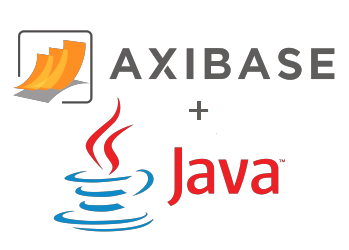

# ATSD Java Client



[](https://travis-ci.org/axibase/atsd-api-java)
[](https://codebeat.co/projects/github-com-axibase-atsd-api-java)
[](https://codecov.io/gh/axibase/atsd-api-java)
[](https://mvnrepository.com/artifact/com.axibase/atsd-api-java/)

## Table of Contents

* [Overview](#overview)
* [Implemented Methods](#request-methods)
* [Installing Java Client](#installing-java-client)
* [Examples](#examples)
* [Metadata Processing](#metadata-processing)
* [Data Queries](#data-queries)

## Overview

**ATSD Java Client** enables Java developers to build reporting, analytical, and alerting applications that can read and write data and metadata from
[Axibase Time Series Database](https://axibase.com/docs/atsd/).

Get started by importing the Java Client with **Maven**:

```xml
<dependency>
  <groupId>com.axibase</groupId>
  <artifactId>atsd-api-java</artifactId>
  <version>1.0.10</version>
</dependency>
```

## Implemented Methods

The **ATSD Client for Java** provides an easy-to-use client for interfacing with **ATSD** metadata and data REST API services.
It has the ability to read and write time series values, statistics, properties, alerts, and messages.

### [REST API](https://axibase.com/docs/atsd/api/data/)

The REST API allows you to insert and retrieve data from the database using HTTP requests.

#### Series

* [Series: `query`](https://axibase.com/docs/atsd/api/data/series/query.html)<br>
  Retrieves time series objects for the specified metric, entity, tags, and date range. Applies common time series transformations including aggregation, interpolation, downsampling etc.

* [Series: `insert`](https://axibase.com/docs/atsd/api/data/series/insert.html)<br>
  Inserts a timestamped array of numbers for a given series identified by metric, entity, and series tags.

* [Series: `insert CSV`](https://axibase.com/docs/atsd/api/data/series/csv-insert.html)<br>
  Inserts series values for the specified entity and series tags in CSV format.

#### Properties

* [Properties: `query`](https://axibase.com/docs/atsd/api/data/properties/query.html)<br>
  Retrieves property records for the specified filters including type, entity, key, and time range.

* [Properties: `insert`](https://axibase.com/docs/atsd/api/data/properties/insert.html)<br>
  Inserts an array of properties.

#### Alerts

* [Alerts: `query`](https://axibase.com/docs/atsd/api/data/alerts/query.html)<br>
  Retrieves open alerts for specified filters.

* [Alerts: `history query`](https://axibase.com/docs/atsd/api/data/alerts/history-query.html)<br>
  Retrieves a list of closed alerts matching specified fields.

### [Meta API](https://axibase.com/docs/atsd/api/meta/)

The Meta API allows you to query metadata for metrics, entities, and entity groups in the database.

#### Metrics

* [Metric: `get`](https://axibase.com/docs/atsd/api/meta/metric/get.html)<br>
  Retrieves properties and tags for the specified metric.

* [Metric: `update`](https://axibase.com/docs/atsd/api/meta/metric/update.html)<br>
  Updates fields and tags of the specified metric.

* [Metric: `create or replace`](https://axibase.com/docs/atsd/api/meta/metric/create-or-replace.html)<br>
  Creates a metric with specified fields and tags or replaces the fields and tags of an existing metric.

* [Metric: `delete`](https://axibase.com/docs/atsd/api/meta/metric/delete.html)<br>
  Deletes the specified metric.

* [Metric: `series tags`](https://axibase.com/docs/atsd/api/meta/metric/series-tags.html)<br>
  Retrieves unique series tags values for the specified metric.

#### Entities

* [Entity: `get`](https://axibase.com/docs/atsd/api/meta/entity/get.html)<br>
  Retrieves fields and tags describing the specified entity.

* [Entity: `update`](https://axibase.com/docs/atsd/api/meta/entity/update.html)<br>
  Updates fields and tags of the specified entity.

* [Entity: `create or replace`](https://axibase.com/docs/atsd/api/meta/entity/create-or-replace.html)<br>
  Creates an entity with specified fields and tags or replaces the fields and tags of an existing entity.

* [Entity: `delete`](https://axibase.com/docs/atsd/api/meta/entity/delete.html)<br>
  Deletes the specified entity and removes the entity from any entity groups it belongs to.

* [Entity: `metrics`](https://axibase.com/docs/atsd/api/meta/entity/metrics.html)<br>
  Retrieves a list of metrics collected by the entity.
  
#### Entity Groups

* [Entity Group: `get`](https://axibase.com/docs/atsd/api/meta/entity-group/get.html)<br>
  Retrieves information about the specified entity group including its name and user-defined tags.

* [Entity Group: `update`](https://axibase.com/docs/atsd/api/meta/entity-group/update.html)<br>
  Updates fields and tags of the specified entity group.

* [Entity Group: `create or replace`](https://axibase.com/docs/atsd/api/meta/entity-group/create-or-replace.html)<br>
  Creates an entity group with specified fields and tags or replaces the fields and tags of an existing entity group.

* [Entity Group: `delete`](https://axibase.com/docs/atsd/api/meta/entity-group/delete.html)<br>
  Deletes the specified entity group.

* [Entity Group: `get entities`](https://axibase.com/docs/atsd/api/meta/entity-group/get-entities.html)<br>
  Retrieves a list of entities that are members of the specified entity group and are matching the specified filter conditions.

* [Entity Group: `add entities`](https://axibase.com/docs/atsd/api/meta/entity-group/get-entities.html)<br>
  Retrieves a list of entities that are members of the specified entity group and are matching the specified filter conditions.

* [Entity Group: `set entities`](https://axibase.com/docs/atsd/api/meta/entity-group/set-entities.html)<br>
  Sets members of the entity group from the specified entity list.

* [Entity Group: `delete entities`](https://axibase.com/docs/atsd/api/meta/entity-group/delete-entities.html)<br>
  Removes the specified members from the entity group.

---

## Installing Java Client

**Prerequisites**:

* [Install ATSD](https://axibase.com/docs/atsd/installation/)
* Java `1.7+`

Installing **ATSD Java Client** via Maven is recommended. Build the **ATSD Java Client** with Maven after cloning the GitHub code.

```sh
git clone https://github.com/axibase/atsd-api-java.git
cd atsd-api-java
mvn clean dependency:copy-dependencies compile jar:jar
cd target
java -cp "atsd-api-java-1.0.8.jar:dependency/*" -Daxibase.tsd.api.client.properties=./client.properties com.axibase.tsd.example.AtsdClientWriteExample
```

## Examples

* [`AtsdClientReadExample`](https://github.com/axibase/atsd-api-java/blob/master/src/main/java/com/axibase/tsd/example/AtsdClientReadExample.java)
* [`AtsdClientWriteExample`](https://github.com/axibase/atsd-api-java/blob/master/src/main/java/com/axibase/tsd/example/AtsdClientWriteExample.java)

## Client Configuration

### `-Daxibase.tsd.api.client.properties=./client.properties`:

```java
        ClientConfiguration clientConfiguration = ClientConfigurationFactory
            .createInstance()
            .createClientConfiguration();
        HttpClientManager httpClientManager = new HttpClientManager(clientConfiguration);
        DataService dataService = new DataService(httpClientManager);
        MetaDataService metaDataService = new MetaDataService(httpClientManager);
```

**`client.properties`** example:

```properties
    axibase.tsd.api.server.name=atsd_server
    axibase.tsd.api.server.port=8080
    #axibase.tsd.api.server.port=8443
    #axibase.tsd.api.protocol=https
    #axibase.tsd.api.ssl.errors.ignore=true
    axibase.tsd.api.username=username
    axibase.tsd.api.password=pwd
```

Usage:

```java
    AtsdClientWriteExample atsdClientWriteExample = new AtsdClientWriteExample();
    atsdClientWriteExample.configure();
    atsdClientWriteExample.writeData();
    atsdClientWriteExample.printData();
```

### Pure Java

```java
        ClientConfigurationFactory configurationFactory = new ClientConfigurationFactory(
                "http", "atsd_server", 8080, // serverPort
                "/api/v1", "/api/v1",
                "username", "pwd",
                3000, // connectTimeoutMillis
                3000, // readTimeoutMillis
                600000, // pingTimeout
                false, // ignoreSSLErrors
                false // skipStreamingControl
                false // enableGzipCompression
        );
        ClientConfiguration clientConfiguration = configurationFactory
            .createClientConfiguration();
        System.out.println("Connecting to ATSD: " + clientConfiguration.getMetadataUrl());
        HttpClientManager httpClientManager = new HttpClientManager(clientConfiguration);

        GenericObjectPoolConfig objectPoolConfig = new GenericObjectPoolConfig();
        objectPoolConfig.setMaxTotal(5);
        objectPoolConfig.setMaxIdle(5);

        httpClientManager.setObjectPoolConfig(objectPoolConfig);
        httpClientManager.setBorrowMaxWaitMillis(1000);

    DataService dataService = new DataService(httpClientManager);
    MetaDataService metaDataService = new MetaDataService(httpClientManager);
```

Usage:

```java
        AtsdClientWriteExample atsdClientWriteExample = new AtsdClientWriteExample();
        atsdClientWriteExample.pureJavaConfigure();
        atsdClientWriteExample.writeData();
        atsdClientWriteExample.printData();
```

### Spring

See **`example-beans.xml`**:

```xml
        <bean id="example" class="com.axibase.tsd.example.AtsdClientWriteExample"/>
        <bean id="dataService" class="com.axibase.tsd.client.DataService"/>
        <bean id="metaDataService" class="com.axibase.tsd.client.MetaDataService"/>
        <bean id="httpClientManager" class="com.axibase.tsd.client.HttpClientManager"/>
        <bean id="genericObjectPoolConfig"
            class="org.apache.commons.pool2.impl.GenericObjectPoolConfig">
            <property name="maxTotal" value="3"/>
        </bean>
        <bean id="clientConfiguration"
            class="com.axibase.tsd.model.system.ClientConfiguration">
            <constructor-arg name="url" value="http://atsd_server:8080/api/v1"/>
            <constructor-arg name="username" value="username"/>
            <constructor-arg name="password" value="pwd"/>
        </bean>
```

Usage:

```java
            ApplicationContext context =
                new ClassPathXmlApplicationContext("example-beans.xml");
            AtsdClientWriteExample example =
                (AtsdClientWriteExample)context.getBean("example");
            example.writeData();
            example.printData();
```

### Metadata Processing

```java
        String metricExample = "jvm_memory_used_percent";
        Metric metric = metaDataService.retrieveMetric(metricExample);
        if (metric == null) {
            System.out.println("Unknown metric: " + metricExample);
            return;
        }
        List<EntityAndTags> entityAndTagsList = metaDataService
            .retrieveEntityAndTags(metric.getName(), null);
        System.out.println("===Metric MetaData===");
        System.out.println("Metric: " + metric);
        for (EntityAndTags entityAndTags : entityAndTagsList) {
            String entityName = entityAndTags.getEntityName();
            System.out.println("\n===Entity MetaData===");
            System.out.println("Entity: " + entityName);
            Map<String, String> tags = entityAndTags.getTags();
            System.out.println("===Tags===");
            for (Map.Entry<String, String> tagAndValue : tags.entrySet()) {
                System.out.println("\t" + tagAndValue.getKey() + " : " + tagAndValue.getValue());
            }
        }
```

### Data Queries

```java
        GetSeriesQuery command = new GetSeriesQuery(entityName, metric.getName(), tags,
            System.currentTimeMillis() - 3600, System.currentTimeMillis());
        command.setAggregateMatcher(
            new SimpleAggregateMatcher(new Interval(1, IntervalUnit.MINUTE),
            Interpolate.NONE,
            AggregateType.DETAIL));
        List<GetSeriesResult> getSeriesResults =
            dataService.retrieveSeries(command);
        for (GetSeriesResult getSeriesResult : getSeriesResults) {
            System.out.println("Time Series Key: "
                + getSeriesResult.getTimeSeriesKey());
            List<Series> data = getSeriesResult.getData();
            for (Series series : data) {
                long ts = series.getT();
                System.out.println(toISODate(ts) + "\t" + series.getV());
            }
        }
```